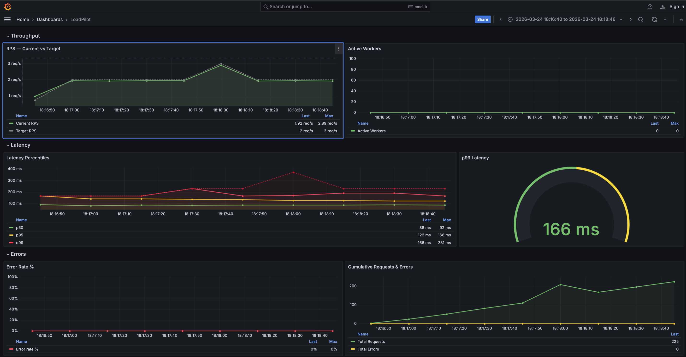
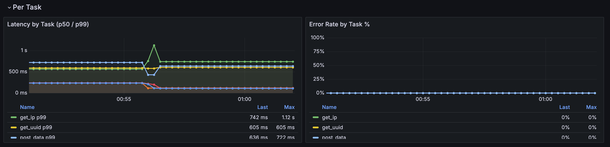

# Monitoring

LoadPilot exposes a Prometheus metrics endpoint and ships a pre-provisioned
Grafana dashboard that updates in real time during a test run.

---

## Grafana Dashboard



The dashboard has four sections:

| Section | Panels |
|---|---|
| **Throughput** | RPS — Current vs Target, Active Workers |
| **Latency** | Latency Percentiles (p50 / p95 / p99 / max), p99 gauge |
| **Errors** | Error Rate %, Cumulative Requests & Errors |
| **Per Task** | Latency by Task (p50 / p99), Error Rate by Task % |

The **Per Task** section is populated automatically when a scenario defines multiple
named `@task` methods. A `$task` template variable lets you filter by individual
endpoints. Tasks appear in the legend as soon as the first scrape completes.



---

## Prometheus metrics

The coordinator exposes metrics at `:9090/metrics` during a run:

| Metric | Description |
|---|---|
| `loadpilot_current_rps` | Observed request rate |
| `loadpilot_target_rps` | Configured target RPS |
| `loadpilot_active_workers` | Active VUser threads |
| `loadpilot_latency_p50_ms` | p50 latency (ms) |
| `loadpilot_latency_p95_ms` | p95 latency (ms) |
| `loadpilot_latency_p99_ms` | p99 latency (ms) |
| `loadpilot_latency_max_ms` | Max latency (ms) |
| `loadpilot_requests_total` | Cumulative request count |
| `loadpilot_errors_total` | Cumulative error count |

### Per-task metrics

When a scenario has named tasks the coordinator also emits per-task metrics with
a `task` label:

| Metric | Description |
|---|---|
| `loadpilot_task_requests_total{task="..."}` | Cumulative requests for this task |
| `loadpilot_task_errors_total{task="..."}` | Cumulative errors for this task |
| `loadpilot_task_latency_p50_ms{task="..."}` | p50 latency for this task (ms) |
| `loadpilot_task_latency_p99_ms{task="..."}` | p99 latency for this task (ms) |
| `loadpilot_task_latency_mean_ms{task="..."}` | Mean latency for this task (ms) |

Task names come from the method names of `@task`-decorated functions in your
scenario class.

---

## Local setup (single machine)

```bash
loadpilot run scenarios/checkout.py --target https://api.example.com
```

The coordinator starts automatically. Forward Prometheus and open Grafana:

```bash
# Grafana ships embedded in the HTML report — open after the run:
open results/report.html

# Or run Prometheus + Grafana separately and point them at :9090
```

---

## Kubernetes (Helm)

The Helm chart deploys Prometheus and Grafana with the dashboard
pre-provisioned. See [Development → Helm Chart](development.md#helm-chart-in-progress)
for install instructions.

```bash
# Forward Grafana to localhost
kubectl port-forward -n loadpilot svc/loadpilot-grafana 3000:3000
```

Then open [http://localhost:3000](http://localhost:3000) — login `admin` / `<adminPassword>`.

### Coordinator in-cluster (recommended)

Deploy the coordinator as a persistent pod so Prometheus can scrape it from
inside the cluster — no host networking hacks required:

```bash
# Build and load the coordinator image
docker build -f engine/Dockerfile.coordinator -t loadpilot-coordinator:local .
kind load docker-image loadpilot-coordinator:local --name <cluster-name>

# Deploy with coordinator enabled
helm upgrade loadpilot cli/loadpilot/charts/loadpilot \
  -n loadpilot --reuse-values \
  --set coordinator.enabled=true \
  --set coordinator.image=loadpilot-coordinator \
  --set coordinator.tag=local \
  --set coordinator.imagePullPolicy=Never

# Port-forward coordinator API and run via it
kubectl port-forward -n loadpilot svc/loadpilot-coordinator 8080:8080
loadpilot run scenarios/checkout.py \
  --target https://api.example.com \
  --coordinator-url http://localhost:8080
```

Prometheus scrapes `loadpilot-coordinator:9090` in-cluster automatically when
`coordinator.enabled=true`.

### Coordinator running locally (alternative)

To scrape a coordinator running on the host machine:

```bash
helm upgrade loadpilot cli/loadpilot/charts/loadpilot \
  --set monitoring.coordinator.scrapeTarget=host.docker.internal:9090
```
